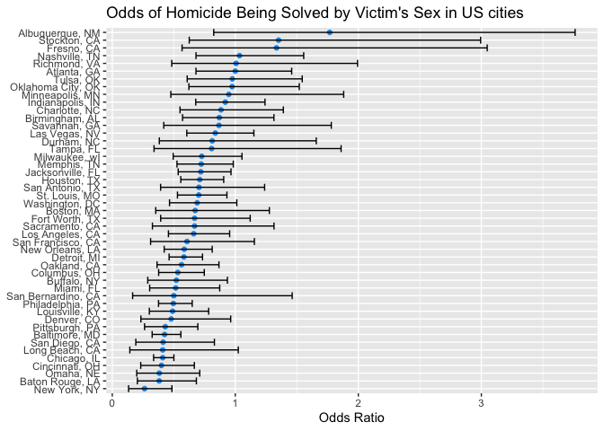
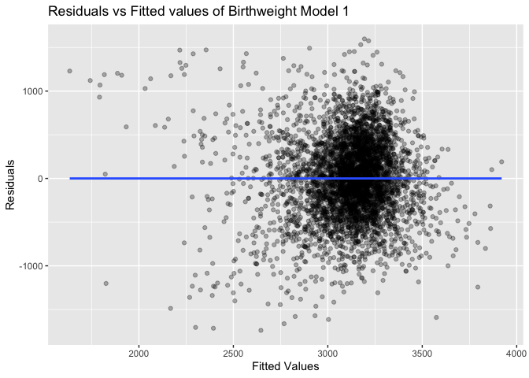
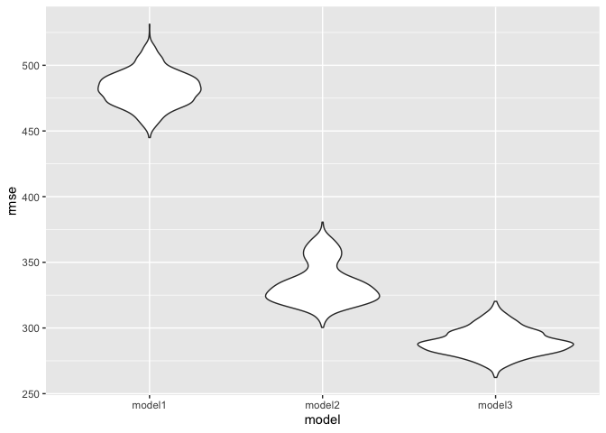

p8105_hw6_av2718
================
Angelica Vina Albarracin
2022-12-03

# Problem 2

``` r
#Load data raw data
homicide_raw = read_csv("data/homicide-data.csv") %>% 
  janitor::clean_names()

#Visualize first 8 rows
head(homicide_raw, 8) # view first 8 rows of raw data
## # A tibble: 8 × 12
##   uid    repor…¹ victi…² victi…³ victi…⁴ victi…⁵ victi…⁶ city  state   lat   lon
##   <chr>    <dbl> <chr>   <chr>   <chr>   <chr>   <chr>   <chr> <chr> <dbl> <dbl>
## 1 Alb-0…  2.01e7 GARCIA  JUAN    Hispan… 78      Male    Albu… NM     35.1 -107.
## 2 Alb-0…  2.01e7 MONTOYA CAMERON Hispan… 17      Male    Albu… NM     35.1 -107.
## 3 Alb-0…  2.01e7 SATTER… VIVIANA White   15      Female  Albu… NM     35.1 -107.
## 4 Alb-0…  2.01e7 MENDIO… CARLOS  Hispan… 32      Male    Albu… NM     35.1 -107.
## 5 Alb-0…  2.01e7 MULA    VIVIAN  White   72      Female  Albu… NM     35.1 -107.
## 6 Alb-0…  2.01e7 BOOK    GERALD… White   91      Female  Albu… NM     35.2 -107.
## 7 Alb-0…  2.01e7 MALDON… DAVID   Hispan… 52      Male    Albu… NM     35.1 -107.
## 8 Alb-0…  2.01e7 MALDON… CONNIE  Hispan… 52      Female  Albu… NM     35.1 -107.
## # … with 1 more variable: disposition <chr>, and abbreviated variable names
## #   ¹​reported_date, ²​victim_last, ³​victim_first, ⁴​victim_race, ⁵​victim_age,
## #   ⁶​victim_sex
```

This problem focuses on the `Homicide-data.csv` that The Washington Post
gathered in 50 large U.S. cities and made available through GitHub. The
raw data comprises 52179, 12observations. The data included the
geographical location of the homicide, whether an arrest was made, and,
in most cases, basic demographic information about each victim. In
total, the dataset contains 12 variables: city, disposition, lat, lon,
reported_date, state, uid, victim_age, victim_first, victim_last,
victim_race, victim_sex. Interestingly, the first and last names of the
victims are included in the data, as well as the race of the victim, and
exact location of the homicide (lat and log).

In the code chunk below, we create a `city_state` variable (e.g.,
“Baltimore, MD”) and a binary variable `disposition` indicating whether
the homicide was solved. We omit cities Dallas, TX; Phoenix, AZ; and
Kansas City, MO – these don’t report victim race. Also omit Tulsa, AL –
this is a data entry mistake.

``` r
#Clean and arrange raw variables, create city_state variable, and make 'disposition' a binary variable

homicide_clean = homicide_raw %>% 
  mutate(
    city_state = str_c(city, ", " ,state), 
    disposition = if_else(disposition %in% "Closed by arrest", 1, 0),
    disposition = as.numeric(disposition),
     victim_age = as.numeric(victim_age)) %>% 
  filter(!city_state %in% c("Dallas, TX", "Phoenix, AZ", "Kansas City, MO", "Tulsa, AL"), #filter by city
         victim_race %in% c("White", "Black")) %>% #filter by race
  mutate(victim_race = fct_relevel(victim_race, "White")
         )%>% 
  select(!c(city, state))
    

#Visualize first 8 rows of new dataframe

head(homicide_clean, 8) # view first 8 rows of tidied data
## # A tibble: 8 × 11
##   uid        repor…¹ victi…² victi…³ victi…⁴ victi…⁵ victi…⁶   lat   lon dispo…⁷
##   <chr>        <dbl> <chr>   <chr>   <fct>     <dbl> <chr>   <dbl> <dbl>   <dbl>
## 1 Alb-000003  2.01e7 SATTER… VIVIANA White        15 Female   35.1 -107.       0
## 2 Alb-000005  2.01e7 MULA    VIVIAN  White        72 Female   35.1 -107.       0
## 3 Alb-000006  2.01e7 BOOK    GERALD… White        91 Female   35.2 -107.       0
## 4 Alb-000009  2.01e7 MARTIN… GUSTAVO White        56 Male     35.1 -107.       0
## 5 Alb-000012  2.01e7 LUJAN   KEVIN   White        NA Male     35.1 -107.       0
## 6 Alb-000016  2.01e7 GRAY    STEFAN… White        43 Female   35.1 -107.       1
## 7 Alb-000018  2.01e7 DAVID   LARRY   White        52 Male     NA     NA        1
## 8 Alb-000019  2.01e7 BRITO   ELIZAB… White        22 Female   35.1 -107.       1
## # … with 1 more variable: city_state <chr>, and abbreviated variable names
## #   ¹​reported_date, ²​victim_last, ³​victim_first, ⁴​victim_race, ⁵​victim_age,
## #   ⁶​victim_sex, ⁷​disposition
```

For the city of Baltimore, in the code chunk below use the glm function
to fit a logistic regression with resolved vs unresolved as the outcome
and victim age, sex and race as predictors. To do this, we first filter
our data set to select the Baltimore data:

``` r
baltimore_data = homicide_clean %>% 
  filter(city_state == "Baltimore, MD") #new dataset with Baltimore data

#Fit logistic regression

glm1_baltimore = baltimore_data %>% 
  glm(disposition ~ victim_age + victim_sex + victim_race, data = ., family = binomial()) 

glm1_results = glm1_baltimore %>% 
  broom::tidy(conf.int = T) %>% 
  mutate(OR = exp(estimate)) %>%
  select(term, log_OR = estimate, OR, p.value, conf.low, conf.high) 

print(glm1_results)
## # A tibble: 4 × 6
##   term               log_OR    OR  p.value conf.low conf.high
##   <chr>               <dbl> <dbl>    <dbl>    <dbl>     <dbl>
## 1 (Intercept)       1.15    3.16  1.14e- 6   0.692   1.62    
## 2 victim_age       -0.00673 0.993 4.30e- 2  -0.0133 -0.000246
## 3 victim_sexMale   -0.854   0.426 6.26e-10  -1.13   -0.584   
## 4 victim_raceBlack -0.842   0.431 1.45e- 6  -1.19   -0.501
```

Now, we run glm for each of the cities in our dataset, and extract the
adjusted odds ratio (and CI) for solving homicides comparing male
victims to female victims.

``` r

#nest data and run glm on each city

glm2_allcities = homicide_clean %>% 
  select(city_state, victim_race, victim_age, victim_sex, disposition) %>%
  nest(data = -city_state) %>% 
  mutate(models = map(data, ~glm(disposition ~ victim_age + victim_sex + victim_race, data = .x, family = binomial())),
         results = map(models, ~broom::tidy(x = .x, conf.int = TRUE))) %>% 
  select(-data, -models) %>% 
  unnest(results) %>% 
  filter(term %in% "victim_sexMale") %>% #filter by sex 
  mutate(OR = exp(estimate),
         conf.low = exp(conf.low),
         conf.high = exp(conf.high))
```

Lastly, we create a plot that shows the estimated ORs and CIs for each
city:

``` r

glm2_plot = glm2_allcities %>% 
  ggplot(aes(x = OR, y = reorder(city_state, OR)))+ #reorder cities according to proportion of homicides
  geom_point(color = 4)+
  geom_errorbar(aes(xmin = conf.low, xmax = conf.high))+ # add error bars based on CIs
  labs(
    title = "Odds of Homicide Being Solved by Victim's Sex in US cities",
    x = "Odds Ratio",
    y = "US City" +
 theme(axis.text.x = element_text(angle = 90, vjust = 0.5, hjust = 1)) +
  theme(axis.text.y = element_text(size = 6)) +
  theme(plot.title = element_text(hjust = 0)) +
  theme(axis.ticks = element_blank()) +
  theme(axis.text = element_text(size = 7)) +
  theme(legend.title = element_text(size = 8)) +
  theme(legend.text = element_text(size = 6)) +
  theme(plot.title = element_text(hjust = 0.5))
  )

glm2_plot
```

<!-- -->

*Odds of Homicide Being Solved by Victim’s Sex in US cities:* In the
plot, we see that in the majority of US cities, it is less likely to be
a male victim in a solved homicide than being female, as the majority of
cities have an odds ratio that is less than 1 for being a male victim.
In Albuquerque, the odds of being a male victim in a solved homicide are
significantly higher than that of a female victim. In contrast, in New
York City, the odds ratio is the lowest in the US, and the odds of being
a female victim in a solved homicide than a male victim is higher
compared to other cities. It’s important to note that there is a lot of
variability in the data, and the CIs are large. Therefore, the data must
be interpreted cautiously before drawing further conclusions.

# Problem 3

In this problem, we will analyze data gathered to understand the effects
of several variables on a child’s birth weight. We start by loading and
cleaning the data:

``` r
birth_weight = read_csv("data/birthweight.csv", na = "") %>%
  janitor::clean_names() %>% 
  mutate(
    babysex = as.factor(babysex),
    frace = as.factor(frace),
    malform = as.factor(malform),
    mrace = as.factor(mrace))
  
  anyNA(birth_weight)
## [1] FALSE
```

*Model Justification:* I am from Colombia, one of the countries in
Latino America with the highest adolescent pregnancy rate. One out of
every five women under 19 has been through a pregnancy. Therefore, I am
interested in the relationship between birthweight and mum’s age and
other factors that might contribute to this relationship, such as
gestational age in weeks. Therefore, I propose a birthweight model with
predictors of the mother’s age and gestational age in weeks. I selected
these three factors for my model. Being a mother at a younger (under 19)
or older age (over 35) confers a higher risk of preterm birth, which is
strongly associated with birth weight.

``` r

#Fit linear model

model1_mlr = 
  lm(bwt ~ momage + gaweeks, data = birth_weight)
model1_mlr %>% 
  broom::tidy()
## # A tibble: 3 × 5
##   term        estimate std.error statistic   p.value
##   <chr>          <dbl>     <dbl>     <dbl>     <dbl>
## 1 (Intercept)    300.      92.4       3.25 1.17e-  3
## 2 momage          11.9      1.83      6.50 9.23e- 11
## 3 gaweeks         65.3      2.25     29.0  2.83e-169
  

#Plot linear model
  
model1_plot2 = 
  birth_weight %>%
  modelr::add_residuals(model1_mlr) %>%
  modelr::add_predictions(model1_mlr) %>% 
  ggplot(aes(x = pred, y = resid)) +
  geom_point(alpha = 0.3) + 
  geom_smooth(se = FALSE, method = "lm") + 
  labs(title = "Residuals vs Fitted values of Birthweight Model 1", 
       x = "Fitted Values", 
       y = "Residuals")
  
model1_plot2
```

<!-- -->

*Comments on regression model:* There is a lot of heteroscedasticity in
our plot. As you can see, that the points vary greatly in the distance
from the regression line; this suggests unequal variance in the fitted
values of our model. Therefore, we can’t trust the results of our
regression model.

``` r
#run MLR model with length at birth and gestational age

model2_mlr = lm(bwt ~ blength + gaweeks, data = birth_weight) 
summary(model2_mlr)
## 
## Call:
## lm(formula = bwt ~ blength + gaweeks, data = birth_weight)
## 
## Residuals:
##     Min      1Q  Median      3Q     Max 
## -1709.6  -215.4   -11.4   208.2  4188.8 
## 
## Coefficients:
##              Estimate Std. Error t value Pr(>|t|)    
## (Intercept) -4347.667     97.958  -44.38   <2e-16 ***
## blength       128.556      1.990   64.60   <2e-16 ***
## gaweeks        27.047      1.718   15.74   <2e-16 ***
## ---
## Signif. codes:  0 '***' 0.001 '**' 0.01 '*' 0.05 '.' 0.1 ' ' 1
## 
## Residual standard error: 333.2 on 4339 degrees of freedom
## Multiple R-squared:  0.5769, Adjusted R-squared:  0.5767 
## F-statistic:  2958 on 2 and 4339 DF,  p-value: < 2.2e-16

#run MLR model with head circumference, length, sex and their interactions

model3_mlr = lm(bwt ~ bhead + blength + babysex + bhead*blength + bhead*babysex + blength*babysex + bhead*blength*babysex, data = birth_weight)
summary(model3_mlr)
## 
## Call:
## lm(formula = bwt ~ bhead + blength + babysex + bhead * blength + 
##     bhead * babysex + blength * babysex + bhead * blength * babysex, 
##     data = birth_weight)
## 
## Residuals:
##      Min       1Q   Median       3Q      Max 
## -1132.99  -190.42   -10.33   178.63  2617.96 
## 
## Coefficients:
##                          Estimate Std. Error t value Pr(>|t|)    
## (Intercept)            -7176.8170  1264.8397  -5.674 1.49e-08 ***
## bhead                    181.7956    38.0542   4.777 1.84e-06 ***
## blength                  102.1269    26.2118   3.896 9.92e-05 ***
## babysex2                6374.8684  1677.7669   3.800 0.000147 ***
## bhead:blength             -0.5536     0.7802  -0.710 0.478012    
## bhead:babysex2          -198.3932    51.0917  -3.883 0.000105 ***
## blength:babysex2        -123.7729    35.1185  -3.524 0.000429 ***
## bhead:blength:babysex2     3.8781     1.0566   3.670 0.000245 ***
## ---
## Signif. codes:  0 '***' 0.001 '**' 0.01 '*' 0.05 '.' 0.1 ' ' 1
## 
## Residual standard error: 287.7 on 4334 degrees of freedom
## Multiple R-squared:  0.6849, Adjusted R-squared:  0.6844 
## F-statistic:  1346 on 7 and 4334 DF,  p-value: < 2.2e-16

#cross validation between models

cv_df =
  crossv_mc(birth_weight, 1000) %>% 
  mutate(
    train = map(train, as_tibble),
    test = map(test, as_tibble))

cv_df = 
  cv_df %>% 
  mutate(
    model1_mlr  = map(train, ~lm(bwt ~ ppwt + ppbmi + wtgain + delwt, data = .x)),
    model2_mlr     = map(train, ~lm(bwt ~ blength + gaweeks, data = .x)),
    model3_mlr  = map(train, ~lm(bwt ~ bhead + blength + babysex + bhead*blength + bhead*babysex + blength*babysex + bhead*blength*babysex, data = as_tibble(.x)))) %>% 
  mutate(
    rmse_model1 = map2_dbl(model1_mlr, test, ~rmse(model = .x, data = .y)),
    rmse_model2   = map2_dbl(model2_mlr, test, ~rmse(model = .x, data = .y)),
    rmse_model3  = map2_dbl(model3_mlr, test, ~rmse(model = .x, data = .y)))

cv_df %>% 
  select(starts_with("rmse")) %>% 
  pivot_longer(
    everything(),
    names_to = "model", 
    values_to = "rmse",
    names_prefix = "rmse_") %>% 
  mutate(model = fct_inorder(model)) %>% 
  ggplot(aes(x = model, y = rmse))+
  geom_violin()
```

<!-- -->

*Comments on model comparission:* Models 2 and 3 have comparable RMSE
values and appear similar in predicting a baby’s birth weight. The model
we developed, which has as predictors mother’s age and gestational
weeks, has a higher error. Therefore, it seems that the better model to
predict birthweight is model 3, which has the lowest RMSE and accounts
for head circumference, length, sex, and all interactions (including the
three-way interaction) between these predictors. Depending on our goal,
one model will ultimately be better than the other; if our goal is to
calculate birth at weight, then model 3 is the best. However, our model
or another model which includes external factors (e.g., smoking, mum’s
weight, etc.) will give us more information if our goal is to understand
which health behaviors and external factors are associated with higher
or lower birth weight.
